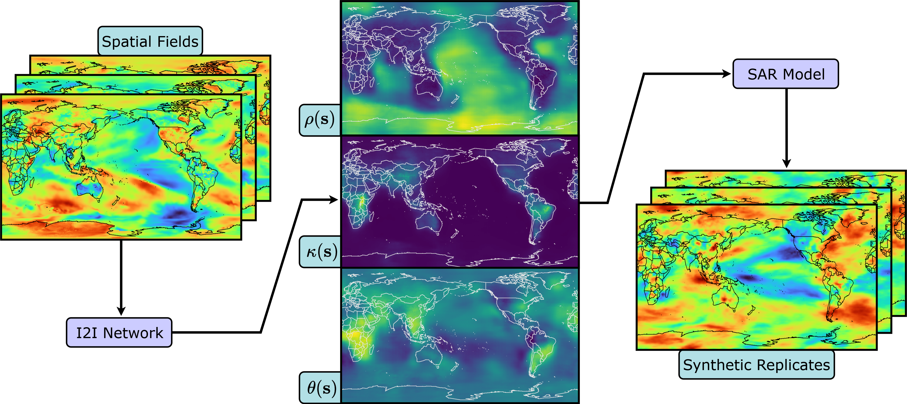

# LatticeVision 

This repository contains everything you need to train image-to-image (I2I) neural networks—using both U-Net and transformer-based architectures—for non-stationary parameter estimation on large spatial datasets. You’ll find tutorial notebooks, data-generation scripts, training and evaluation procedures, and example applications to climate-model outputs. All code accompanies our paper:

*LatticeVision: Image to Image Networks for Modeling Non-Stationary Spatial Data*

**Authors**: Antony Sikorski, Michael Ivanitskiy, Nathan Lenssen, Douglas Nychka, Daniel McKenzie

The paper is currently available on [arXiv](https://arxiv.org/abs/2505.09803).

<p align="center">
  
<p align="center"><em>Figure: An illustration of the main workflow of LatticeVision. Spatial fields are fed into an I2I
network, which in turn produces estimates of the non-stationary parameter fields. These are encoded
into a SAR model from which synthetic replicates are efficiently simulated. </em></p>

---

## Installation

Prior to running this code, one will need to download `Python`, `R` and `RStudio`, clone this repository, and install all necessary dependencies. 

- **R:** The `R` programming language may be downloaded [here](https://cran.r-project.org/bin/windows/base/). We recommend [`RStudio`](https://posit.co/download/rstudio-desktop/) for opening and working with the `R` scripts (training data and synthetic field generation). 

- **Python:** The `Python` programming language may be downloaded [here](https://www.python.org/downloads/). We use [`uv`](https://docs.astral.sh/uv/getting-started/installation/) as our package manager. 

- **Cloning this repo:** This repository can be cloned by running 
```
git clone https://github.com/antonyxsik/LatticeVision.git
``` 
in your terminal. 

- **Dependencies:**
  - For `Python`: You can install the necessary dependencies and create a virtual environment using [`uv`](https://docs.astral.sh/uv/) by running 
  ```
  uv sync
  ```
   
  If you do not wish to use `uv`, you can create a virtual environment however you wish, and run 

  ```
  pip install -r requirements.txt
  ```
   
  Both install the `latticevision` package, which contains our primary source code.
  - For `R`: All dependencies can be downloaded by opening and running the `R_scripts/required_packages.R` script.

## Quick Start 

To get started with our code, download our sample data, network weights (for the `STUN` and `CNN25` networks trained on 30 replicates), and their climate application results from [this Google Drive folder](https://drive.google.com/drive/folders/1OcgHHqqNmK48qdvHCP_PQpXXKq_EYCWD?usp=sharing):

1. Prepare `data/` and `results/` folders: 
  - Create `data/` in the root of this project (ignored by Git), then download and place `I2I_sample_data.h5` and `CNN_sample_data.h5` from Google Drive. 
  - Create `results/` in the root of this project (also ignored), with subfolders `clim_outputs/` and `model_wghts/`. Download the corresponding Google Drive components for both folders. 

2. Explore our tutorial/demo style notebooks in `notebooks/` (`i2i_demo.ipynb`, `cnn_demo.ipynb`, `cesm_application.ipynb`) to get a sense for our core workflows and codebase. These should all point to/utilize the network weights and sample data that you downloaded. 

3. Optionally, run `make test` to run all tests, and run `make help` to print out other available commands. 

## Reproducing Results

### Data Generation
In order to reproduce our results, one must first generate the data:
- To generate synthetic training/testing data for the I2I networks, one must simply run `R_scripts/i2i_datagen.R`. Instructions:
  1. Open the file in `RStudio`.
  2. Set the working directory to be that of the source file location (see the "Important" note in the file).
  3. Choose the total size of the dataset and the chunk size that it will be created in (below the "Important" note and the imports).
  4. Run the script (``Ctrl+A``, then ``Ctrl+Enter``). This will create `data/I2I_data.h5`. 
- To make the data for the CNNs, one repeats the same process as above with `R_scripts/cnn_datagen.R`. This will create `data/CNN_data.h5`.

### Train Models and Test on Synthetic Data
- You can train **all** of the I2I networks by running the `notebooks/i2i_trainloop.py`. 
- **All** CNNs can be trained by running `notebooks/cnn_trainloop.py`.
- Both of these scripts train the networks, evaluate them on synthetic test data (results saved in `results/metrics`), and then pass the climate model fields through the networks (saved in `results/clim_outputs`). 

**Note**: These scripts will train 4 U-Nets, 16 ViTs, 16 STUNs, and 12 CNNs due to different combinations of replicates, positional embeddings, window size, and other hyperparameters. This may be quite computationally intensive. We highly recommend modifying the lists in the scripts (that determine which hyperparams like n_replicates to loop through) to reflect the networks that you are interested in training and evaluating.  


### Climate Application
- The training scripts above automatically generate the parameter estimates for the climate model fields in `results/clim_outputs`. 
- Alternatively, one can also load a trained network into `notebooks/cesm_application.ipynb` and uncomment the saving code to create these. 
- After the parameters have been estimated, open `R_scripts/cesm_ensemble_sim.R` and point towards the outputs of interest in order to generate synthetic climate ensembles and reproduce our correlation comparison experiments. 

---

## Citation

Please use the following BibTeX to cite this work: 

```{bibtex}
@article{sikorski2025latticevision,
  title={LatticeVision: Image to Image Networks for Modeling Non-Stationary Spatial Data},
  author={Sikorski, Antony and Ivanitskiy, Michael and Lenssen, Nathan and Nychka, Douglas and McKenzie, Daniel},
  journal={arXiv preprint arXiv:2505.09803},
  year={2025}
}
```

